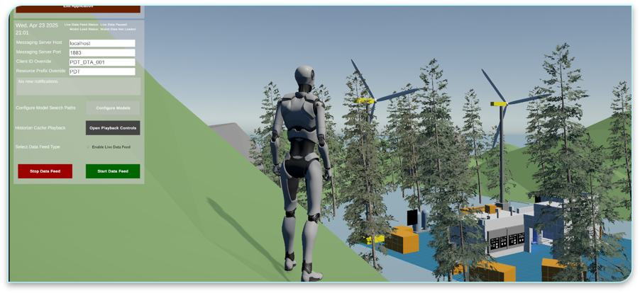
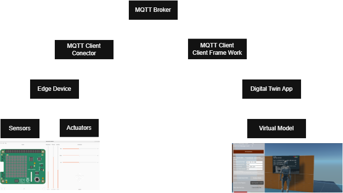
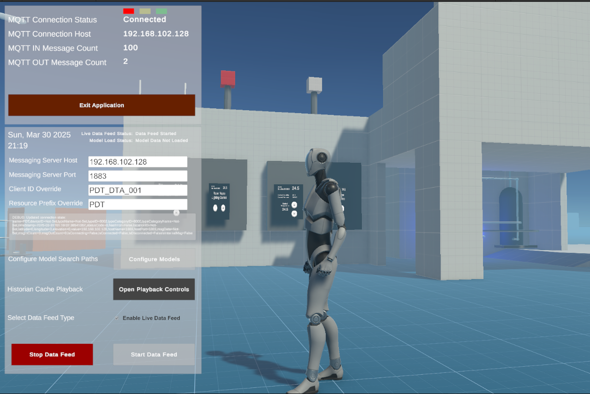
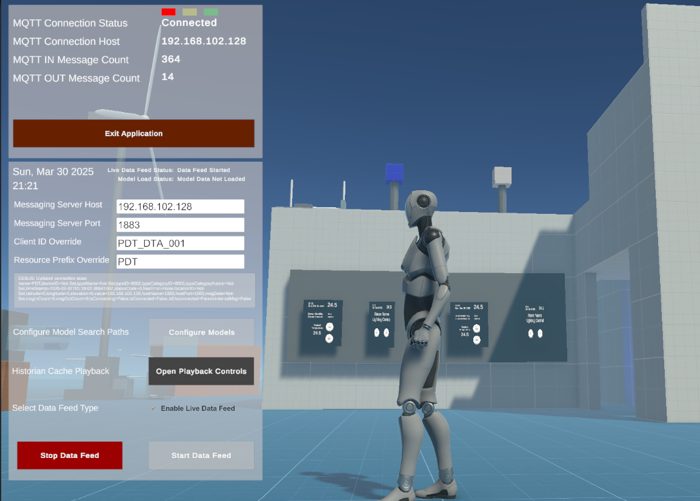
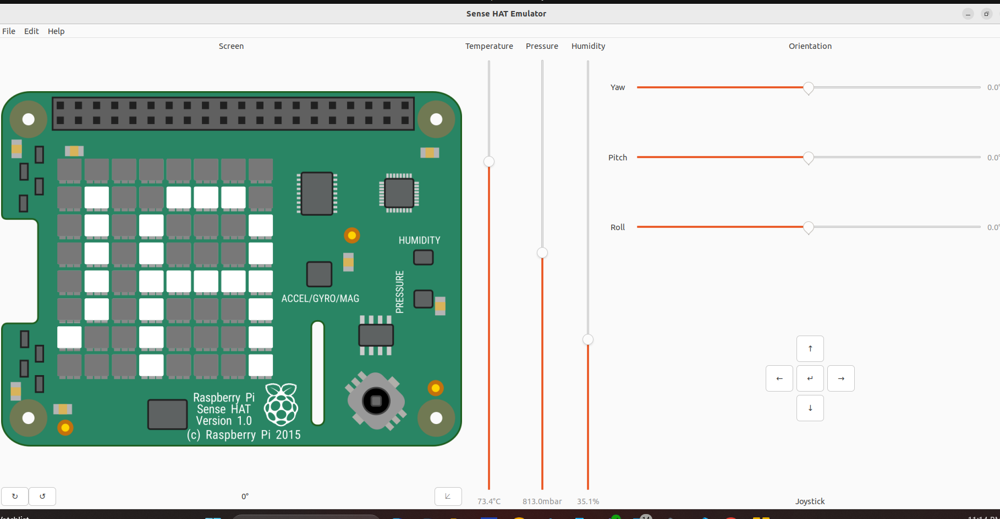
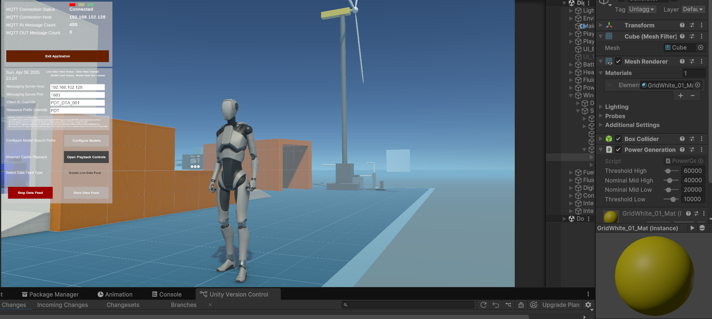
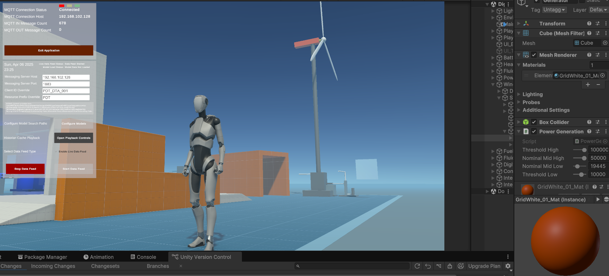
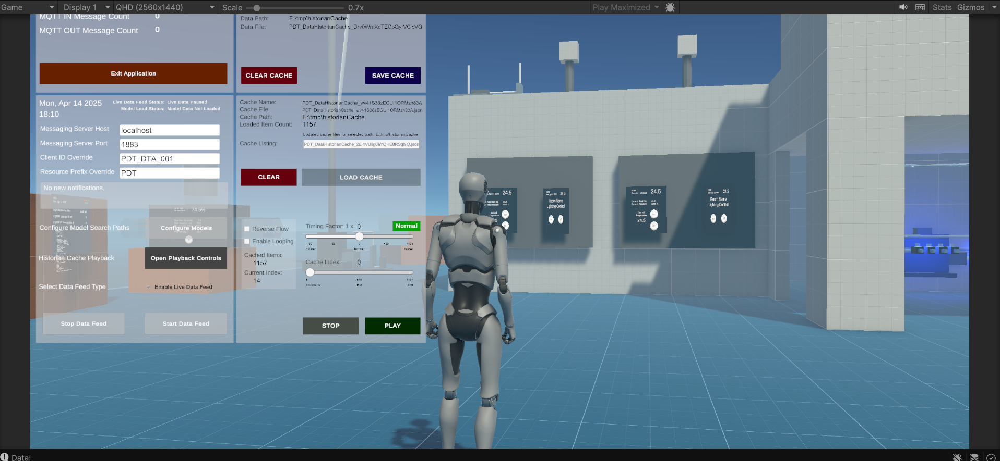

# PowerStation_Monitoring_With_DigitalTwin
A real-time, interactive power station monitoring system that leverages edge computing, digital twin visualization, and AI-assisted predictive maintenance for effective system management and user training.

## Project Overview
This project simulates and manages a wind turbine power station using a two-part architecture:

## Edge Device App (Running on Raspberry Pi 5):
-Collects real-time telemetry data from a Sense HAT emulator including:
    -Temperature
    -Humidity
    -Pressure
    -Simulated wind turbine performance data is also generated here.

## Digital Twin Application (DTA):
- Receives data from the edge device over MQTT and offers a complete digital twin experience via:
- A Client Framework Component for data handling and AI integration.
- A Unity Component for immersive 3D visualization and real-time system monitoring.

## Application/Use Cases

## System Performance & Management
- Real-time data received via MQTT is visualized in the Unity-based digital twin.
- Graphical interface allows operators to monitor environmental parameters and turbine behavior.
- Automated or manual control decisions can be taken based on telemetry data.
Example: Trigger HVAC system if temperature exceeds threshold.

## Predictive Maintenance
- Gives a visual feedback of the systems based on the wearing out and maintainance of the system.
- Integrates with a locally hosted Ollama AI model to interpret sensor data and identify potential failures or maintenance requirements.
- Offers AI-generated solutions or repair recommendations.
- Supports preventive actions before critical faults occur, reducing downtime.

## User Training & Event Playback
- System records historical telemetry data locally.
- Provides playback functionality to:
- Analyze past events or abnormal behavior.
- Train new users by simulating real scenarios.
- Enhances learning and operational safety through immersive replay in the digital twin environment.
